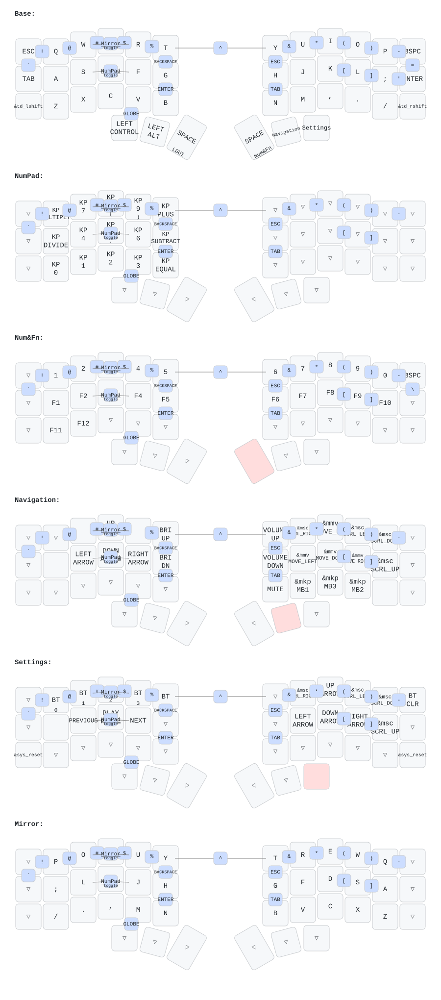

# Mac Focused Corne ZMK Keyboard Layout

A corne-ish split keyboard layout, optimised for:

1. almost standard mac keyboard key positioning.
   - heavily using combos to make up for reduced keys

2. **'left hand on key board, right hand on the mouse'**
   - left hand combos allow layer toggling
     - numbpad and common math/calculator symbols
     - mirrored qwerty layer, so i can hit all shortcuts without lifting left hand onto right half of the keyboard.
3. basic mouse emulationright hand.
4. easy access to settings and media playback buttons

Layout as follows:

