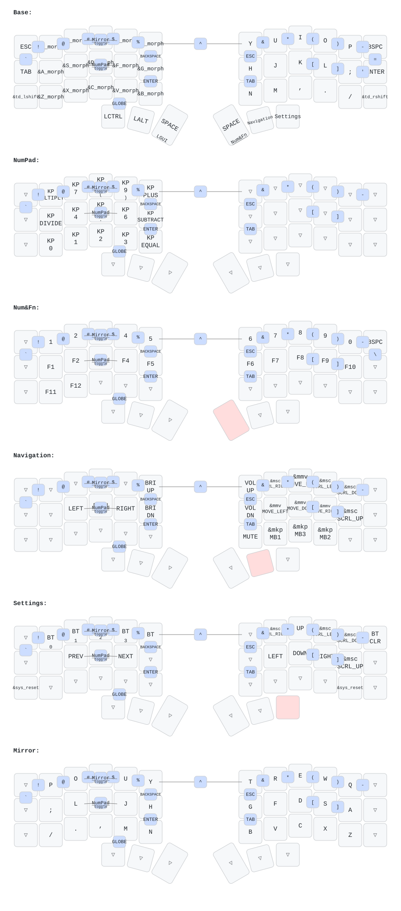

# Mac-Focused Corne ZMK Layout

A keyboard layout for a wireless ‘Corne’ style keyboard; 42 keys total, positioned in a 3*6(+3 thumbs) layout. 

Built to be my daily driver coming from 20 years of Mac muscle memory…

## Optimised for

1. **Familiar Mac key positions.** Standard QWERTY, with combos covering the keys the board lacks. Done in a way that muscle memory is still similar to vanilla Mac keyboards, but with ergonomic gains.
2. **Keyboard-only pointer control as the default**, so you have access to all normal mouse movements, scrolling & buttons. Allows you to efficiently work with keyboard only so you don’t have to keep taking your hand off the keyboard. Especially if you’re doing light browsing, or cruising through code or a spreadsheet.
3. **Left hand on keyboard, right hand on mouse when you need it.** Creative task cannot be done with keyboard only. If you need a mouse, the mirror layers I’ve set up mean you shouldn’t have to take your hand off it. All right hand keys can be accessed with the left hand.
4. **Custom Number Pad Layer** for efficient data entry when working.
5. **Quick access to settings and media.** Easy access to volume, screen brightness, playback control and quick change Bluetooth profiles. So you can get back to work!
6. Respects MacOS, iOS and iPadOS keyboard behaviour differences. Whilst being 90% perfect on Windows and Linux.

## Layers & Layout

*Diagram generated with [Keymap Drawer](https://github.com/caksoylar/keymap-drawer).*

### Layers

| # | Layer | How to reach it | Contents |
|---|-------|-----------------|----------|
| 0 | Base | default | QWERTY, Mac-style modifiers |
| 1 | Mirror | toggle: `W+E+R` (or `U+I+O`) | Right-half letters on the left half, so Mac shortcuts can be typed one-handed |
| 2 | NumPad | toggle: `X+C+V` (or `M+,+.`) | Numpad and calculator symbols on the left half; hold `8`/`9`/`5` for `(`, `)`, `.` |
| 3 | Num & Fn | hold first right thumb key (tap = Space) | Number row and F1–F12 |
| 4 | Navigation | hold second right thumb key | Arrows, brightness, volume, mouse move, scroll and buttons |
| 5 | Settings | hold third right thumb key | Bluetooth profiles, media transport, firmware reset |

`S+D+F` (or `J+K+L`) returns to Base from Mirror or NumPad.

### Timing

- **Left thumb (Cmd/Space):** hold = Cmd, tap = Space. Hold registers after 60 ms, so Cmd shortcuts feel immediate. Used to ‘play’ media on browsers and some applications.
- **NumPad digits:** tap = digit, hold = bracket or period (200 ms term, 165 ms quick-tap).
- **Pointer:** movement ramps to full speed over 350 ms, scroll over 175 ms. Means you can move efficiently and predictably on a large screens when using IJKL keys. 